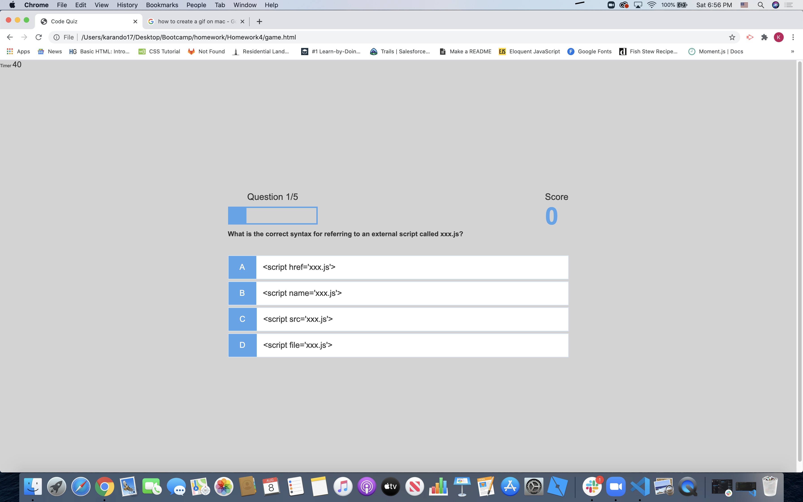

# 04 Web APIs: Code Quiz - READ ME:

* The first approach to creating the quiz was to create a homepage for the game and applied some basic CSS styling via the style.css file. Then 
I added two buttons into the homepage to play the game and to
direct users to the high scores page. 

* Then I proceeded with building the game html page with a corresponding game css file for styling. This page contains a heads up display(hud) that hold the progress bar and the user score. Then I created p tags within the h2 id "questions" called choice-prefix and choice-text which provides the layout for the user choices. 

* I then created the scripts.js to make the quiz interactive. To reference the question ID and the choice-text class, I created the const question and const choices.  I added a custom data attribute to every single choice-text class in order to differentiate them from one another. I then used the Array.from function when declaring the choice-text class to convert the 4 different choices into an array. 

* I then created a new set of variables as components to the game including the 5 multiple choice questions under the variable questions. I also created a couple of constants for the # of points a user gets per correct answer and the maximum number of questions.  

* I created a startGame function to set the question counter (or progress bar) to 0, set the score to 0 at the start of the game and to call on the available questions array. 

* The getNewQuestion function is created to start the question counter and to randomize the quiz question using the Math.floor function.  I also used the forEach loop to populate the choice boxes. I spliced out questionIndex in order to avoid repetition of questions already asked. Then added another forEach loop for the choices and added an event listener so the choice selected references the appropriate data-set attribute. Also called on a getNewQuestion with a time delay for a new question to be generated after the previous question has been answered. Added some animation to turn incorrect answer buttons red and correct answer buttons green by declaring the const toApplyclass and styling the correct and incorrect classes through the game.css.

* At the end of the game, the user is then taken to end game page (end.html) so they can log their score and username and hit the save button.  They can then select the home button where there is an option to go to the highscore page (highscores.html) where the last 5 highscores are saved via local storage. To allow the user the save their username and most recent score via local storage, I used the localStorage.setItem function. 

* I also created a timer that starts when the quiz starts.  
:

####Final Product Image:

